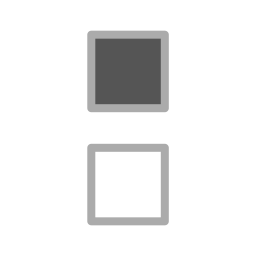

# After Effects Scripts

A collection of After Effects utilities for KBar, Tool Launcher, Quick Menu, or any other script file launcher.

These tools were developed mainly for my own personal workflow and may not have been tested very thoroughly. As After Effects evolves, some scripts may stop working or need maintenance. Run them at your own discretion.

## Installation Instructions

1. Open the script you want from the catalog below.
2. Download the corresponding `.jsx` file.
3. In After Effects, go to `File > Scripts > Run Script File...` and choose the downloaded script.

## Categories

- App: 2
- Project: 14
- Comp: 15
- Layer: 16
- Effect: 10
- Keyframe: 3
- Expression: 5

## App

###  Allow EXR Straight Alpha

Allow After Effects to render EXR with a straight alpha channel. This changes an AE preference setting and needs an AE restart to take effect after it's run.

###  Purge

Purge RAM

| Modifier | Action |
| --- | --- |
| Shift-click | Purge disk cache |

## Project

###  Assemble Comps

Assembles selected items in a new comp minus handles

###  Audio Off

Mutes all layers with audio in all comps in the project

###  Comps to Projects

Saves each selected composition as a separate reduced .aep in a chosen output folder

###  Count

Alerts the number of selected items in the Project panel and selected layers in the active comp

###  Default Folders

Creates standard set of folders and sets project to OCIO 1.3 at 16bpc

###  Font Report

Scans project for fonts used and generates report

###  Ignore Alpha

Ignore alpha for selected footage in the project panel

###  Import Project

Import AE Project and merge folders with existing project structure

###  Prefix Suffix

Add a prefix or suffix to the names of selected project items

###  Reduce & Keep Folders

Reduce project but keep all folders

| Modifier | Action |
| --- | --- |
| Shift-click | Regular reduce project |

###  Relative Importer

Import files relative to the currently open project

###  Relink

Relink selected missing footage by recursively searching a chosen folder

###  Search & Replace

Search and replace names in selected project items

###  Viewer Resolution

Changes Viewer Resolution in all comps to Full

| Modifier | Action |
| --- | --- |
| Shift-click | Half resolution |
| Cmd-click | Quarter resolution |

## Comp

###  Add Handles

Add frames to beginning or end of a comp. Selected layers will extend to fill the new time.

###  Auto Slate

Copies layers from a "slate" comp in project to current comp(s)

| Modifier | Action |
| --- | --- |
| Shift-click | Adds 1 frame at the beginning for the slate |

### `CDL` Auto CDL

Search for CDL matching comp name pattern of SHOW_000_001_010

###  Create Mattes

Create matte comp by filling selected layers with white and other layers with black

| Modifier | Action |
| --- | --- |
| Shift-click | Duplicates comp first and adds "_matte" |

###  Add LUT

New Adjustment Layer w/ LUT

###  Precomp

Precomp selected layers, retaining the timecode of the original comp

| Modifier | Action |
| --- | --- |
| Shift-click | Precomp single layer with collapse transformations |

###  PSD Pre-Render

Render a PSD of the current frame. Auto saves to 05_prerenders/PSD directory of the current project and imports again to the same comp.

###  Render Hi-Res

Add hi-res to render queue

| Modifier | Action |
| --- | --- |
| Alt-click | Set render templates |

###  Render Low-Res

Add low-res to render queue

| Modifier | Action |
| --- | --- |
| Alt-click | Set render templates |

###  Save Photo

Saves current frame as PSD

| Modifier | Action |
| --- | --- |
| Shift-click | Saves JPEG (if template is available) |
| Cmd-click | Saves PNG in the background to the desktop |

###  Scale Comps

Scale one or more selected compositions and all layers within them. Select comps in the Project panel before running, or leave a comp open to scale just that one.

###  Shutter

Set shutter angle and phase for motion blur

###  Textless

Recursively hide text layers

| Modifier | Action |
| --- | --- |
| Shift-click | Duplicate comp and nested comps, hiding text layers in all |

###  Trim Layers to Comp

Trim all layers in selected comp(s) if they extend beyond the beginning or end of the comp

###  Version Up

Version up selected comps in the project panel

| Modifier | Action |
| --- | --- |
| Shift-click | Duplicates the comp |
| Cmd-click | Version up letters |

## Layer

###  Checkerboard

Creates 16x8 checkerboard layer

| Modifier | Action |
| --- | --- |
| Shift-click | Creates 32x16 checkerboard layer |
| Cmd-click | Creates 16-wide square checkerboard layer |

### `FRCTL NOISE` Fractal Noise

New layer w/ Fractal Noise

| Modifier | Action |
| --- | --- |
| Shift-click | Precomposes the fractal noise |

###  Add grain

Adds Grain adjustment layer

| Modifier | Action |
| --- | --- |
| Shift-click | Apply Match Grain adjustment layer |
| Cmd-click | Higher grain intensity adjustment layer |

###  Add Null

Add Null

| Modifier | Action |
| --- | --- |
| Shift-click | Applies Copied Data to the Null |
| Cmd-click | Starts null at playhead |

###  Paste

Paste at the beginning of the selected layer

###  Gradient Ramp

Create new solid ramp for a DoF map

| Modifier | Action |
| --- | --- |
| Shift-click | Center gradient |
| Cmd-click | Precomp the gradient |

###  Reload Selected Layers

Reload the file sources of selected layers if After Effects doesn't detect it automatically

###  Reverse Layers

Reverse selected layers

###  Scale Aware Properties

Adds an expression for known properties that don't scale along with a layer's scale

###  Smart Grid

Makes a smart grid from the selected layers in the current comp

| Modifier | Action |
| --- | --- |
| Shift-click | Adds null Grid Controller with parameters to control the grid |
| Cmd-click | Removes the Grid Controller and bakes all the children to their current positions |

###  Black Solid

New Black Solid

| Modifier | Action |
| --- | --- |
| Shift-click | 50% grey layer |

###  White Solid

New White Solid

| Modifier | Action |
| --- | --- |
| Shift-click | Sets to blending mode to Classic Color Dodge |

### `SPLT MSK` Split Layer Masks

Split a layer's masks into individual layers named after each mask

| Modifier | Action |
| --- | --- |
| Shift-click | Split into grouped masks by name prefix instead |

###  Stagger Layers

Stagger layers by a certain number of frames

###  Track in Mocha

Track in Mocha AE Plugin. Renames layer to "Mocha Track" and turns it brown.

| Modifier | Action |
| --- | --- |
| Shift-click | Mocha Pro Plugin |
| Cmd-click | Mocha Pro Standalone |

###  Transform Null for Mocha

Creates null and sets it as the transform null for the selected layers Mocha AE or Mocha Pro effect

## Effect

###  Blur

Apply gaussian blur

| Modifier | Action |
| --- | --- |
| Shift-click | Apply camera lens blur |
| Cmd-click | Creates a depth map for camera lens blur |

###  Curves

Apply curves

| Modifier | Action |
| --- | --- |
| Shift-click | New adjustment layer with curves |

###  Fill

Fill selected layers with black

| Modifier | Action |
| --- | --- |
| Shift-click | Fill selected layers with white |
| Cmd-click | Apply invert effect to select layers |

###  High-Pass

Adds a set of effects with sliders for a high pass filter

| Modifier | Action |
| --- | --- |
| Shift-click | Will add reduce noise and precomp before applying high pass |

###  Levels

Apply levels

| Modifier | Action |
| --- | --- |
| Shift-click | New adjustment layer with levels |

###  Randomize Seeds

Randomize random seed properties of all effects of selected layers

###  Reduce Noise

Apply Neat Video's reduce noise v5

| Modifier | Action |
| --- | --- |
| Shift-click | Precomp de-noise |
| Cmd-click | Grain subtraction method |

###  Reset Layer Effects

Reset layer controls for all effects on selected layers

| Modifier | Action |
| --- | --- |
| Shift-click | Reset layer controls for all effects on all layers |

###  Set Matte

Set matte effect to layer above selected layer

| Modifier | Action |
| --- | --- |
| Shift-click | Set matte all selected layers to layer above first selected layer |

###  Tint

Apply tint

| Modifier | Action |
| --- | --- |
| Shift-click | Creates new adjustment layer with effect |
| Cmd-click | Apply hue/saturation |

## Keyframe

###  Ease Between

Eases out the first keyframe and eases in the second keyframe

###  Key Before & After

Adds keyframes before & after the current playhead

| Modifier | Action |
| --- | --- |
| Shift-click | Only add keyframe before |
| Cmd-click | Only add keyframe after |

###  Match Rate

Match linear rate of two selected keyframes to current play head position. Can do multiple properties at once.

## Expression

###  Blink

Adds a blinking expression to the opacity with adjustable sliders

| Modifier | Action |
| --- | --- |
| Shift-click | Uses a blink that fades between start opacity and 0 |

###  Parent

Adds a parent expression to selected property with an intensity slider

###  Rate Controller

Adds a Rate Controller effect and expression to give a constant rate of time * multiplier

###  Smooth Expression

Apply smoothing expression to selected properties

###  Wiggle Slider

Adds a wiggle slider for the selected property(s)

| Modifier | Action |
| --- | --- |
| Shift-click | Creates a wiggle null with sliders |
| Cmd-click | Creates property specific sliders |

_This README is auto-generated by `.github/scripts/generate-readme.mjs`._
